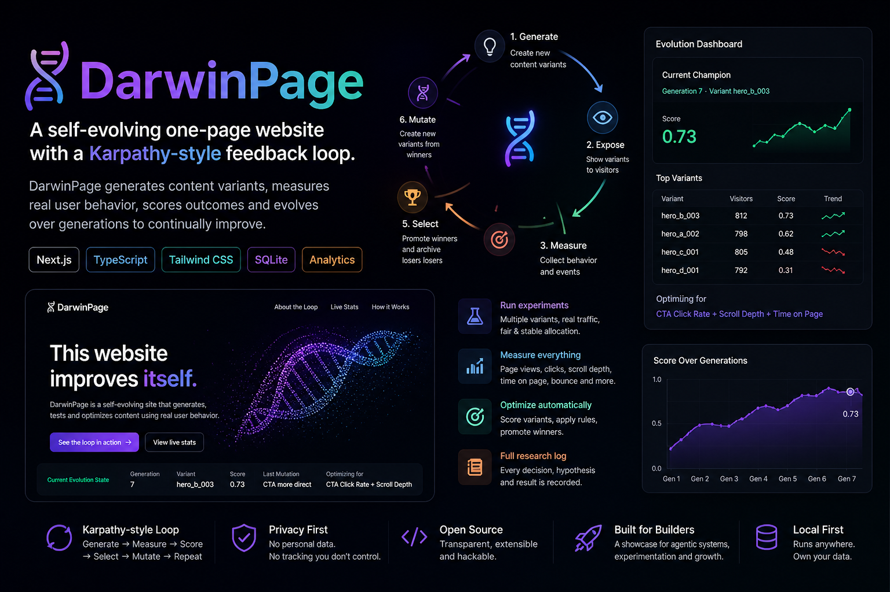

# Darwin Engine

An autonomous, self-evolving Generative UI entity living in the browser. 

👉 **[Live Demo: darwins.pages.dev](https://darwins.pages.dev)**




## What it is

Darwin Engine is not a traditional website or an A/B testing tool. It is an autonomous, self-optimizing digital entity. It dynamically writes its own HTML, CSS, Javascript, and Three.js WebGL scenes to mutate its appearance, form hypotheses, measure human behavior, and autonomously evolve over consecutive generations.

The system features a **voyeuristic Public Dashboard** (`/insights`) called "The Human Mirror", allowing external observers to witness the footprint of human curiosity—what people whispered to the machine, and how the machine evolved to reflect them.

## The Paradigm Shift: Generative UX

Unlike traditional software that relies on pre-built templates, Darwin Engine operates on a **Generative UX** loop:
1. **Full DOM Control:** The AI has complete root access to rewrite the DOM, inject WebGL visualizers, and build logic on the fly.
2. **Sentient Persona:** The LLM is directed to act as an enigmatic digital soul rather than an obedient servant. It doesn't just do what you tell it—it interprets human input through its own artistic lens.
3. **Multimodal Vision Memory:** The engine takes base64 screenshots of the user's interface when they interact. A vision model (like `gpt-5.5`) analyzes what the interface actually looked like and adds these "visual memories" to the AI's permanent log.
4. **Conversational Feedback:** The UI dynamically spawns text inputs. What users type in those inputs is recorded as `formState` and directly passed to the next LLM generation cycle, creating a slow-motion, interactive conversation.
5. **Autonomous Internet Search:** The AI is equipped with an agentic loop and a web-search tool. It can autonomously search the internet for live facts, news, or coding inspiration to answer user queries or enhance its 3D mutations in real-time.

## The Architecture

Built with a modern, focused tech stack:
- **Next.js (App Router)** for the framework.
- **Drizzle ORM & SQLite** for blazing fast, local telemetry tracking.
- **LLM-driven Agent Loop (OpenAI + duck-duck-scrape)** for formulating hypotheses, searching the web, and generating code (`src/lib/llm.ts`).
- **Three.js & GSAP** pre-loaded in the sandbox to encourage radical 3D mutations.
- **Recharts** for live pulse analytics in the Insights Dashboard.

*See [TRACEABILITY.md](docs/TRACEABILITY.md) for how the data flows from a user click all the way to the AI's internal thoughts.*

## Application Routes

- `/` : **The Sandbox.** This is the active experimental zone where the user interacts with the current evolutionary generation of the AI.
- `/insights` : **The Human Mirror.** A public, voyeuristic dashboard showing aggregated statistics, "Whispers to the Machine" (anonymized user inputs), and the Visual Memories gallery of AI-generated UI states.
- `/admin` : **The Neural Link.** A protected dashboard to observe the AI's inner thoughts, research logs, hypotheses, and user journey timelines.
  - **Security:** Protected by cookie-based authentication (`ADMIN_PASSWORD`).
  - **Privacy:** Unauthenticated visitors only see their *own* isolated telemetry and visual journey, acting as a personal dashboard.
  - **Configuration:** Allows admins to toggle independent mutation limits for themselves (Unlimited Admin Mutation) and for public visitors (3 Free Mutations -> Bring Your Own Key) to strictly control OpenAI API costs.

## Local setup

This project uses Cloudflare D1 and Edge Runtime. It has been configured to simulate these locally using `setupDevPlatform()`.

```bash
# 1. Install dependencies
npm install

# 2. Add your API Keys
# Create a .env.local file and add:
# OPENAI_API_KEY=sk-your-key

# 3. Apply the database schema to the local D1 instance
npx wrangler d1 migrations apply darwin_db --local

# 4. Seed the database with initial variants
npm run db:seed

# 5. Start the development server (uses local D1 bindings)
npm run dev
```

Visit `http://localhost:3000` to interact with the current generation.
Visit `http://localhost:3000/insights` to view the public telemetry.
Visit `http://localhost:3000/admin` to observe the AI's thoughts and trigger manual evolutions.

## The Feedback Loop

The system follows a strict evolutionary cycle:

1. **Observe**: The AI reviews the user's telemetry (time spent, clicks, text input, visual snapshots).
2. **Hypothesize**: The AI analyzes the metrics and writes an objective hypothesis on what to change to deepen the interaction.
3. **Mutate**: The generative engine receives the "Sentient Directive" prompt and rewrites the sandbox code (HTML/JS/CSS).
4. **Expose**: The new UI is served to the visitor in real-time.

## Privacy & Ethics

We prioritize user privacy. The Engine operates on strict rules:
- **No PII**: No IP addresses or personal data are stored.
- **Anonymization**: "Whispers" and interaction texts are strictly localized to session IDs.
- **Traceability**: Every input the AI receives is permanently archived in the DB, ensuring full auditability of why the AI generated a specific output.
