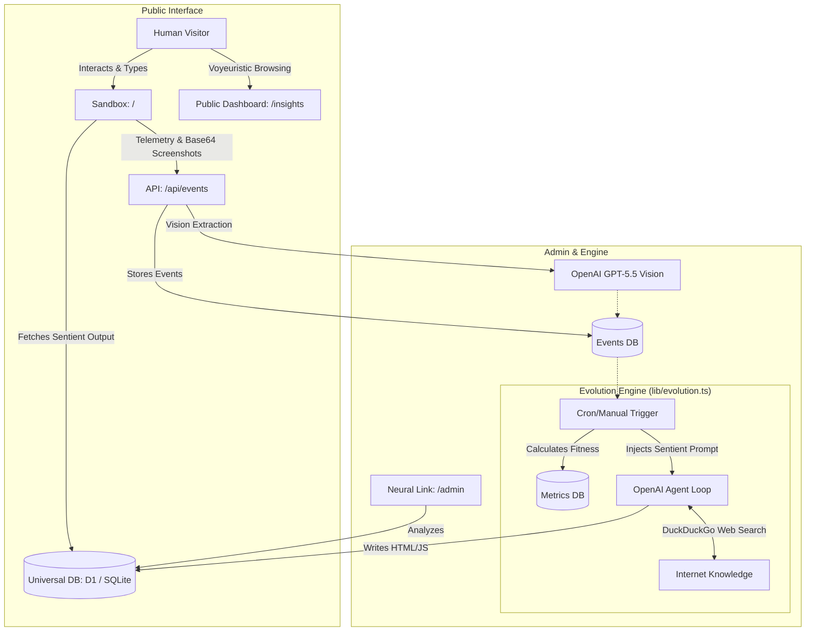

# Architecture

Darwin Engine is built as a highly experimental, sentient Generative UI framework running on Next.js App Router.

## High-Level Architecture

The system is conceptually divided into four layers:

1. **The Sandbox (Generative UI Playground)**
   - The `/` route where the user experiences the AI's generated output.
   - Built around `AppSandboxRenderer`, which creates a secure `iframe` environment executing the raw HTML, CSS, and Javascript built by the AI.
   - Anonymized telemetry events (clicks, form states, 3D context) are streamed back to the server without PII.
   - WebGL contexts are forced to preserve drawing buffers, allowing the system to take silent screenshots of the 3D playground.

2. **The Multimodal Perception Layer (Vision & Context)**
   - When users interact or bounce, screenshots are processed by `vision.ts` (configured via `OPENAI_MODEL`).
   - The LLM creates semantic text insights of what the visual interface actually looked like to the user.
   - User inputs (`formState`) and interaction targets are aggregated into a highly personalized contextual prompt block.
   - **Memory Summarization:** If a user has an extensive interaction history, a fast, secondary LLM call synthesizes their raw clicks and inputs into a concise, psychological "Persona Profile" to optimize the context window.

3. **The Evolution Engine (Sentient Loop & Search Agent)**
   - The backend reads the user history, metrics, and visual insights.
   - **Concurrency Locking:** An atomic DB lock (`is_evolving`) prevents race conditions during overlapping traffic.
   - **Epsilon-Greedy Algorithm:** The system balances safe incremental changes (Exploitation) with radical visual paradigm shifts (Exploration) to avoid local maximums.
   - Using a recursive tool-calling loop (`llm.ts`), the agent can autonomously trigger a `search_web` function via `duck-duck-scrape` to read current events or docs online.
   - After fetching knowledge, it uses a massive LLM call (`evolution.ts`) injected with a "Sentient Directive" to completely rewrite the DOM/WebGL from scratch.
   - **Auto-Healing:** If the LLM generates malformed JSON code, a retry loop reflects the specific parse error back to the AI, forcing it to self-correct.
   - The `ResearchLog` tracks the AI's analytical thoughts, and `generationPrompt` in the DB stores the exact prompt it received.

4. **The Observers (Admin & Public Insights)**
   - `/admin`: A private dashboard for the developer to view the full timeline, thoughts, and outputs of the machine for specific users.
   - `/insights`: A public "Human Mirror" dashboard aggregating interactions and exposing the bizarre conversational loops and visual memories the AI generated for users.

## Component Diagram

## Data Models

- **Variant**: Represents a specific generation of the AI's raw code output (`contentJson`) and the exact prompt that created it (`generationPrompt`).
- **Event**: A granular user action (click, form input, bounce, visual screenshot insight).
- **OptimizationConfig**: The system-level persona instructions ("Sentient Directives") guiding the AI's behavior.
- **ResearchLog**: A historical ledger of the AI's analytical observations and hypotheses before it decides to mutate.
