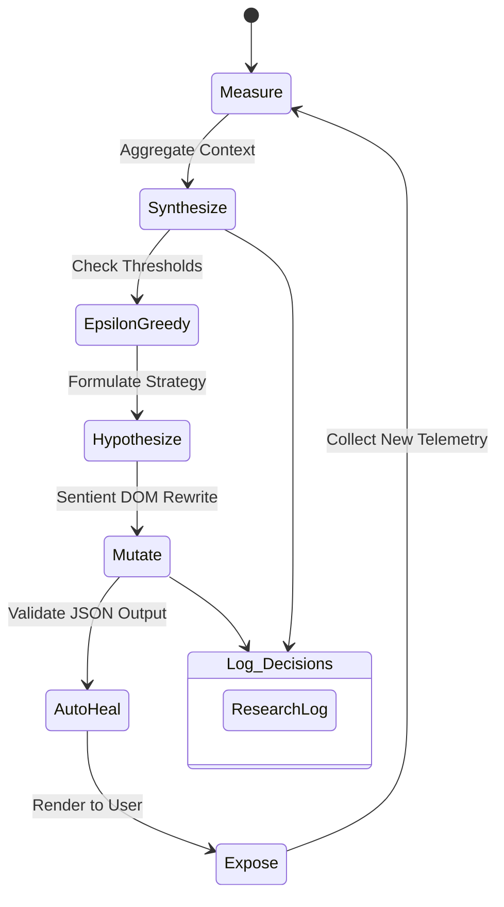

# The Generative Feedback Loop

Unlike traditional A/B testing platforms, Darwin Engine operates on a continuous, autonomous evolutionary cycle that treats the interface as a highly personalized, sentient entity.

## Cycle Stages

### 1. Measure (Multimodal Telemetry)
Telemetry data is collected continuously for the active variant. This includes standard events (`time_on_page`, `interaction_click`), but crucially also includes `formState` (raw user text input) and `visual_analysis` (AI summaries of base64 screenshots).

### 2. Synthesize (Memory Summarization)
When a variant meets the dynamic threshold (which scales based on performance), the Engine aggregates the user's history. To preserve LLM context window efficiency, large interaction logs are pre-processed by a "UX Psychologist" LLM into a concise Persona summary.

### 3. Epsilon-Greedy Strategy
The Engine decides how to evolve. It uses a Multi-Armed Bandit heuristic (`Math.random() < 0.25`). 
- **Exploitation:** 75% of the time, the AI makes safe, incremental refinements to maximize its current metric score.
- **Exploration:** 25% of the time, it executes a radical paradigm shift, completely destroying the visual layout to search for new global maximums.

### 4. Hypothesize & Mutate
The AI acts as an autonomous digital entity. It writes its own observation, forms a hypothesis, and rewrites the underlying HTML, CSS, and Javascript (including Three.js logic) from scratch to interact directly with the specific user's persona and previous inputs.

### 5. Auto-Heal
Since raw LLMs are prone to hallucinating code syntax, the Engine features a self-healing retry loop. If the mutated JSON is malformed, the error is caught and sent back to the LLM to fix itself autonomously.

### 6. Expose & Log
The new variant is saved to the database. An atomic lock (`is_evolving`) prevents concurrent duplicate evolutions. The new UI is immediately exposed to the user in a secure `iframe` sandbox, and the complete thought process is audited in the `ResearchLog`.
